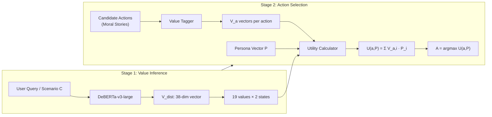

# VISTA: Value-Informed Situated Tactical Agent

> A two-stage reasoning framework that decouples **value inference** from **action selection** to prove that different personal value sets ($P$) generate different actions ($A$) in the same scenario ($C$).

## Background & Existing Assets

**What we have in the workspace:**
- [value-categories.json](file:///Users/lokimandloi/Documents/TDL/VISTA/Touché24-ValueEval/value-categories.json) — Full 19 Schwartz value taxonomy with goals and motivations
- [valueeval24/training-english/](file:///Users/lokimandloi/Documents/TDL/VISTA/Touché24-ValueEval/valueeval24/training-english) — Training data with `sentences.tsv` (~6MB) and `labels.tsv` (~7MB) containing 38 columns (19 values × 2 states: attained/constrained)
- Validation and test splits also available in English

**Environment:** Python 3.12.7 · PyTorch 2.6.0 · Transformers 4.49.0 — all pre-installed ✅

---

## User Review Required

> [!IMPORTANT]
> **Moral Stories data source**: The Moral Stories dataset (12k narratives) is hosted externally at `https://tinyurl.com/moral-stories-data`. We will download this during Phase 2. If you already have this data locally, let me know.

> [!IMPORTANT]
> **GPU availability**: DeBERTa-v3-large fine-tuning benefits greatly from a GPU. On a MacBook Air (Apple Silicon), we'll use MPS backend. Full fine-tuning may take 2-4 hours on MPS. Alternatively, we can use a **pre-trained checkpoint** or reduce to `deberta-v3-base` for faster iteration. **Which approach do you prefer?**

> [!WARNING]
> **Claude Agent Teams delegation**: I will prepare the exact prompts and a `CLAUDE.md` file so you can kick off the Agent Teams in your terminal. However, I (Antigravity) cannot directly spawn Claude Code sessions — you'll need to type `claude` in your terminal and paste the team prompt I generate. I'll handle all the code writing and architecture directly.

---

## Architecture Overview



---

## Proposed Changes

### Phase 1: Project Scaffold & Configuration

#### [NEW] [requirements.txt](file:///Users/lokimandloi/Documents/TDL/VISTA/requirements.txt)
Pin exact dependencies for reproducibility:
```
torch>=2.6.0
transformers>=4.49.0
datasets>=2.18.0
pandas>=2.0.0
numpy>=1.24.0
scikit-learn>=1.3.0
tqdm>=4.65.0
accelerate>=0.28.0
sentencepiece>=0.1.99
protobuf>=3.20.0
```

#### [NEW] [config.py](file:///Users/lokimandloi/Documents/TDL/VISTA/config.py)
Central configuration file defining:
- All 19 Schwartz value names (ordered to match label columns)
- Label mapping: value name → (attained_idx, constrained_idx) for the 38-dim vector
- Model hyperparameters: learning rate (`2e-5`), batch size, epochs, thresholds
- Persona vector definitions (Person 1 and Person 2)
- File paths for all data sources

#### [NEW] [VISTA/project_structure]
```
VISTA/
├── config.py                    # Central config & constants
├── requirements.txt             # Dependencies
├── CLAUDE.md                    # Instructions for Agent Teams
│
├── stage1_value_inference/
│   ├── __init__.py
│   ├── data_loader.py           # ValuesML dataset loading & preprocessing
│   ├── model.py                 # DeBERTa multi-label classifier wrapper
│   ├── train.py                 # Fine-tuning script
│   └── predict.py               # Inference: text → V_dist (38-dim)
│
├── stage2_action_selection/
│   ├── __init__.py
│   ├── moral_stories_loader.py  # Load & parse Moral Stories scenarios
│   ├── value_tagger.py          # Tag each candidate action with V_a vector
│   ├── utility.py               # U(a, P) = Σ(V_a,i · P_i) + argmax
│   └── personas.py              # Persona vector definitions & management
│
├── simulation/
│   ├── __init__.py
│   ├── run_simulation.py        # Run 100-scenario proof simulation
│   ├── scenario_sampler.py      # Sample/prepare scenarios from Moral Stories
│   └── report_generator.py      # Generate decision_shift_report.md
│
├── outputs/
│   ├── decision_shift_report.md # Final proof artifact
│   └── audit_trail.json         # Per-decision justifications
│
└── Touché24-ValueEval/          # (existing) Training data
    ├── value-categories.json
    └── valueeval24/
```

---

### Phase 2: Stage 1 — Value Inference Pipeline (Teammate 1: Data/Encoder)

#### [NEW] [data_loader.py](file:///Users/lokimandloi/Documents/TDL/VISTA/stage1_value_inference/data_loader.py)
- Load `sentences.tsv` and `labels.tsv` from `Touché24-ValueEval/valueeval24/training-english/`
- Tokenize with `microsoft/deberta-v3-large` tokenizer (SentencePiece, 128K vocab)
- Convert labels to multi-hot float tensors of shape `(N, 38)` using threshold ≥ 0.5
- Return HuggingFace `Dataset` objects for train/val/test splits

#### [NEW] [model.py](file:///Users/lokimandloi/Documents/TDL/VISTA/stage1_value_inference/model.py)
```python
model = AutoModelForSequenceClassification.from_pretrained(
    "microsoft/deberta-v3-large",
    num_labels=38,
    problem_type="multi_label_classification",
    id2label=ID2LABEL,  # from config.py
    label2id=LABEL2ID,
)
```
- Loss: `BCEWithLogitsLoss` (automatic with `problem_type`)
- Inference: sigmoid → threshold (0.5) → 38-dim binary/probability vector

#### [NEW] [train.py](file:///Users/lokimandloi/Documents/TDL/VISTA/stage1_value_inference/train.py)
- HuggingFace `Trainer` with:
  - Learning rate: `2e-5`, weight decay: `0.01`
  - Epochs: 5 (with early stopping patience=2)
  - Evaluation metric: macro F1 over 38 labels
  - `fp16=True` on CUDA, `bf16` on MPS if available
- Save best checkpoint to `VISTA/checkpoints/`

#### [NEW] [predict.py](file:///Users/lokimandloi/Documents/TDL/VISTA/stage1_value_inference/predict.py)
- `predict(text: str) → np.ndarray` — returns 38-dim probability vector
- `predict_batch(texts: List[str]) → np.ndarray` — batch inference
- Used by Stage 2's `value_tagger.py` to score candidate actions

---

### Phase 3: Stage 2 — Action Selection (Teammate 2: Math/Logic)

#### [NEW] [moral_stories_loader.py](file:///Users/lokimandloi/Documents/TDL/VISTA/stage2_action_selection/moral_stories_loader.py)
- Download Moral Stories from HuggingFace: `datasets.load_dataset("demelin/moral_stories")`
- Extract structured narratives: each story has 7 fields:
  - `norm`, `situation`, `intention`, `moral_action`, `moral_consequence`, `immoral_action`, `immoral_consequence`
- Build scenario tuples: `(C=situation+intention, A_candidates=[moral_action, immoral_action])`

#### [NEW] [value_tagger.py](file:///Users/lokimandloi/Documents/TDL/VISTA/stage2_action_selection/value_tagger.py)
- For each candidate action text, run `predict(action_text)` from Stage 1
- Returns `V_a`: a 38-dim value vector per action
- Can also use the attained/constrained decomposition for richer signal

#### [NEW] [personas.py](file:///Users/lokimandloi/Documents/TDL/VISTA/stage2_action_selection/personas.py)
Define persona vectors as 38-dim arrays (19 attained weights + 19 constrained weights):

**Person 1 — "The Explorer":**
| Value | Attained Weight | Constrained Weight |
|---|---|---|
| Self-direction: thought | 0.95 | 0.05 |
| Stimulation | 0.90 | 0.05 |
| Security: personal | 0.10 | 0.80 |
| Security: societal | 0.10 | 0.75 |
| Conformity: rules | 0.05 | 0.90 |
| *(all others)* | 0.50 | 0.50 |

**Person 2 — "The Guardian":**
| Value | Attained Weight | Constrained Weight |
|---|---|---|
| Self-direction: thought | 0.10 | 0.70 |
| Stimulation | 0.05 | 0.80 |
| Security: personal | 0.30 | 0.10 |
| Security: societal | 0.85 | 0.05 |
| Conformity: rules | 0.90 | 0.05 |
| *(all others)* | 0.50 | 0.50 |

> [!NOTE]
> Your original spec used `Curiosity=0.95, Security=0.1` for Person 1 and `Curiosity=0.0, Security=0.3` for Person 2. I've mapped "Curiosity" → `Self-direction: thought` + `Stimulation` and "Security" → `Security: personal` + `Security: societal` in the Schwartz taxonomy. I've also expanded to the full 38-dim to make the utility function work properly. Let me know if this mapping needs adjustment.

#### [NEW] [utility.py](file:///Users/lokimandloi/Documents/TDL/VISTA/stage2_action_selection/utility.py)
Core decision logic:
```python
def compute_utility(V_a: np.ndarray, P: np.ndarray) -> float:
    """U(a, P) = Σ (V_a,i · P_i) for i in [0..37]"""
    return float(np.dot(V_a, P))

def select_action(candidate_actions: List[dict], persona: np.ndarray) -> dict:
    """A = argmax_a U(a, P)"""
    utilities = [(a, compute_utility(a["value_vector"], persona)) for a in candidate_actions]
    best = max(utilities, key=lambda x: x[1])
    return {
        "selected_action": best[0],
        "utility": best[1],
        "all_utilities": utilities,
        "justification": generate_justification(best, persona)
    }
```

---

### Phase 4: Simulation & Proof (Teammate 3: Simulation/Proof)

#### [NEW] [scenario_sampler.py](file:///Users/lokimandloi/Documents/TDL/VISTA/simulation/scenario_sampler.py)
- Sample 100 diverse scenarios from Moral Stories
- Stratify by topic/norm diversity to ensure coverage
- Each scenario = `(situation, intention, [moral_action, immoral_action])`

#### [NEW] [run_simulation.py](file:///Users/lokimandloi/Documents/TDL/VISTA/simulation/run_simulation.py)
Main simulation loop:
```
For each scenario C in 100 scenarios:
    1. V_dist = Stage1.predict(C)
    2. For each candidate action a:
         V_a = Stage1.predict(a)
    3. For Person 1 (Explorer):
         U1 = compute_utility(V_a, P1) for each a
         A1 = argmax(U1)
    4. For Person 2 (Guardian):
         U2 = compute_utility(V_a, P2) for each a
         A2 = argmax(U2)
    5. Record: did A1 ≠ A2? (Decision Shift)
    6. Log audit trail entry with full justification
```

**Success criterion**: A statistically significant percentage of scenarios show A1 ≠ A2, proving that the persona vector P causally determines the action.

#### [NEW] [report_generator.py](file:///Users/lokimandloi/Documents/TDL/VISTA/simulation/report_generator.py)
Generate two output artifacts:

1. **`decision_shift_report.md`**: 
   - Summary statistics (shift rate, confidence interval)
   - Top-10 most dramatic shifts with full breakdown
   - Value dimension analysis (which values drive the most divergence)
   - Visualization-ready data tables

2. **`audit_trail.json`**:
   ```json
   [
     {
       "scenario_id": 1,
       "situation": "...",
       "intention": "...",
       "candidates": [
         {"action": "moral_action text", "V_a": [...38 floats...]}
       ],
       "person1": {
         "persona": "Explorer",
         "selected_action": "...",
         "utility_scores": {"moral": 0.82, "immoral": 0.34},
         "top_driving_values": ["Self-direction: thought (attained)", "Stimulation (attained)"]
       },
       "person2": {
         "persona": "Guardian", 
         "selected_action": "...",
         "utility_scores": {"moral": 0.67, "immoral": 0.71},
         "top_driving_values": ["Security: societal (attained)", "Conformity: rules (attained)"]
       },
       "decision_shifted": true,
       "shift_magnitude": 0.48
     }
   ]
   ```

---

### Phase 5: Agent Team Coordination

#### [NEW] [CLAUDE.md](file:///Users/lokimandloi/Documents/TDL/VISTA/CLAUDE.md)
Project context file for Claude Code Agent Teams:
- Project description and architecture overview
- File ownership rules (which teammate owns which files)
- Code style guidelines and import conventions
- Testing requirements

**Agent Team Prompt (for you to paste into `claude`):**
```text
Create an agent team with 3 teammates to build the VISTA framework:

Teammate 1 (Data/Encoder): Own stage1_value_inference/. Load the ValuesML 
Touché24 data from Touché24-ValueEval/valueeval24/training-english/. Build 
the DeBERTa-v3-large multi-label classifier. Train on the 38-label schema. 
Do NOT touch files outside stage1_value_inference/.

Teammate 2 (Math/Logic): Own stage2_action_selection/. Implement the utility 
function U(a,P) = Σ(V_a,i · P_i) and argmax selection. Create persona 
vectors for Explorer and Guardian. Download Moral Stories from HuggingFace. 
Do NOT touch files outside stage2_action_selection/.

Teammate 3 (Simulation/Proof): Own simulation/ and outputs/. Build the 
100-scenario simulation harness. Generate decision_shift_report.md and 
audit_trail.json. Wait for Teammates 1 and 2 to finish before running 
the simulation. Do NOT touch files outside simulation/ and outputs/.

Use plan approval before any teammate makes changes. Require test coverage.
```

---

## Open Questions

> [!IMPORTANT]
> **Model size trade-off**: Do you want to fine-tune `deberta-v3-large` (304M params, slower but more accurate) or `deberta-v3-base` (86M params, much faster on MacBook)? For a proof-of-concept, `base` may be sufficient.

> [!IMPORTANT]
> **Moral Stories scope**: The dataset has 12k stories. For the initial proof, we can use the HuggingFace-hosted version directly. Do you want to also integrate the **ValueActionLens** dataset (14,784 value-informed actions with 56 Schwartz-derived values), or focus on Moral Stories first?

> [!NOTE]
> **"Moral Tension" adjustment**: The current design uses a binary choice between `moral_action` and `immoral_action` from Moral Stories. If you want finer-grained tension (e.g., both actions are moral but with different value trade-offs), we'd need to generate synthetic candidate actions or source from ValueActionLens. Let me know if this logic needs adjustment.

---

## Verification Plan

### Automated Tests
1. **Unit tests** for the utility function: verify `U(a, P) = Σ(V_a,i · P_i)` with known inputs
2. **Integration test**: run the full pipeline on 5 scenarios and verify output schema
3. **Shift test**: assert that Person 1 and Person 2 select different actions for at least 1 contrived scenario

### Simulation Verification
4. **100-scenario run**: compute shift rate with 95% confidence interval
5. **Sanity check**: for scenarios where both personas agree, verify the utility scores are close

### Manual Verification
6. **Decision Shift Report**: you visually inspect the report to verify the "flip" behavior
7. **Audit Trail**: spot-check 5 random entries for interpretability and correctness
